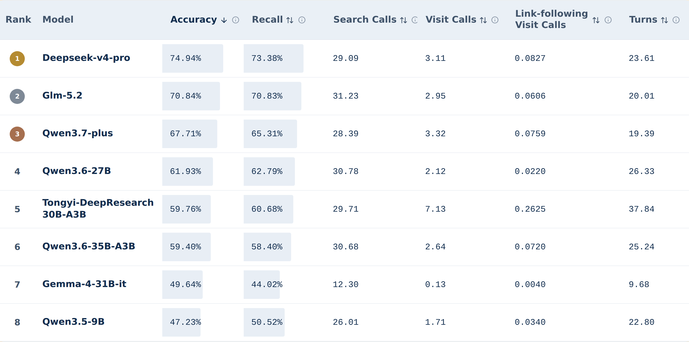

<p align="center">
  
</p>

<p align="center">
  <a href="https://github.com/ml-stat-Sustech/BCP-Link"></a>
  <a href="https://ml-stat-sustech.github.io/bcp-link-leaderboard/"></a>
  <a href="https://huggingface.co/datasets/SUSTech/BCP-Link-corpus"></a>
</p>

<p align="center">
  This repository packages the reproducible <a href="https://github.com/ml-stat-Sustech/SearcherKit">SearcherKit</a> runtime for evaluating deep-research agents on <a href="https://ml-stat-sustech.github.io/bcp-link-leaderboard/">BCP-Link</a>.
</p>

## 📖 Introduction

**BrowseComp-Plus-Link (BCP-Link)** is a benchmark for evaluating how effectively search agents can use hyperlinks to discover evidence beyond initial search results in an offline, fully reproducible search environment. Built on [BrowseComp-Plus](https://arxiv.org/pdf/2508.06600), it recovers 63,371 verified links among the fixed corpus of 100,195 offline webpages. These links are inserted directly into the document text and exposed through standardized `search` and `visit` tools, enabling controlled analysis of whether search agents can recognize useful links, navigate across documents, gather relevant evidence, and reach the correct answer efficiently.

The current release includes:

- **6.5 GB** uncompressed corpus data
- **13.8 MB** link metadata
- **100,195** offline webpages
- **63,371** verified in-corpus hyperlinks
- **17,633** documents with at least one incoming or outgoing link, representing **17.60%** graph participation
- **4.59** outgoing links per document with outgoing links on average

## 🏆 LeaderBoard

The following snapshot ranks models by BCP-Link Accuracy. See the [BCP-Link leaderboard](https://ml-stat-sustech.github.io/bcp-link-leaderboard/) for the current complete table.



## 📚 Table of Contents

- [🛠️ Environment Setup](#environment-setup)
- [📦 Step 1. Prepare the Data](#step-1-prepare-the-data)
- [🔍 Step 2. Start Retrieval Services and Build the Index](#step-2-start-retrieval-services-and-build-the-index)
- [🚀 Step 3. Start the Model Service and Run Inference](#step-3-start-the-model-service-and-run-inference)
- [📊 Step 4. Start the Judge Service and Run Evaluation](#step-4-start-the-judge-service-and-run-evaluation)
- [🤝 Contributing](#contributing)
- [📄 License](#license)

## 🛠️ Environment Setup

The documented setup uses:

- Linux operating system with Bash, `curl`, and `tar`
- Python 3.12 or newer
- At least 25-30 GB of free disk space for the Elasticsearch index and logs
- GPU resources appropriate for the evaluated model, embedding model, and judge

The local service examples use [vLLM](https://docs.vllm.ai/), which must be installed separately in the serving environment. Other deployments can be used when they expose compatible endpoints.

### Installation

The required [SearcherKit](https://github.com/ml-stat-Sustech/SearcherKit) runtime is bundled with this release. Run from the repository root:

```bash
bash setup.sh
```

This installs [`uv`](https://docs.astral.sh/uv/) when needed, synchronizes the Python environment, validates the runtime, and creates `scripts/settings.sh` from the example template without overwriting an existing file. It does not download data or models, install Elasticsearch or vLLM, or start external services.

## 📦 Step 1. Prepare the Data

Download the [BCP-Link corpus](https://huggingface.co/datasets/SUSTech/BCP-Link-corpus) and the 830-question [BrowseComp-Plus](https://huggingface.co/datasets/Tevatron/browsecomp-plus) test split, then prepare the local evaluation files. Run from the repository root:

```bash
uv run python scripts/prepare_data.py
```

Outputs:

```text
data/bcp_link_corpus.jsonl
data/browsecomp_plus_decrypted_qa.jsonl
```

The download is approximately 2.8 GB; the prepared corpus accounts for the 6.5 GB corpus size summarized above. Existing outputs are kept on repeated runs. Use `--force` to recreate them, and run `hf auth login` first if Hugging Face requires authentication.

Optional: use `--output-dir` to choose another location, then update `BCP_LINK_CORPUS` and `BCP_LINK_DATASET` in `scripts/settings.sh`.

## 🔍 Step 2. Start Retrieval Services and Build the Index

This step requires a reachable, unauthenticated Elasticsearch 8.19.18 endpoint and an OpenAI-compatible Qwen3-Embedding-8B endpoint. Skip either local deployment example if a compatible service is already available.

### Start Elasticsearch

Local deployment example for Linux x86-64:

```bash
curl -O https://artifacts.elastic.co/downloads/elasticsearch/elasticsearch-8.19.18-linux-x86_64.tar.gz
tar -xzf elasticsearch-8.19.18-linux-x86_64.tar.gz
```

Run the service as a regular user, not `root`:

```bash
ES_DIR="$PWD/elasticsearch-8.19.18"
ES_WORK_DIR="$PWD/outputs/elasticsearch"
mkdir -p "$ES_WORK_DIR/data" "$ES_WORK_DIR/logs"

"$ES_DIR/bin/elasticsearch" \
  -d \
  -p "$ES_WORK_DIR/elasticsearch.pid" \
  -Ecluster.name=bcp-link-local \
  -Enode.name=bcp-link-node \
  -Epath.data="$ES_WORK_DIR/data" \
  -Epath.logs="$ES_WORK_DIR/logs" \
  -Enetwork.host=127.0.0.1 \
  -Ehttp.port=9200 \
  -Ediscovery.type=single-node \
  -Expack.security.enabled=false
```

For another platform, use the matching package from the [Elasticsearch 8.19.18 release page](https://www.elastic.co/downloads/past-releases/elasticsearch-8-19-18).

### Start the Embedding Service

Local deployment example; replace the model path before running:

```bash
CUDA_VISIBLE_DEVICES=0 vllm serve /path/to/Qwen3-Embedding-8B \
  --served-model-name Qwen3-Embedding-8B \
  --port 8001 \
  --runner pooling \
  --convert embed
```

Adjust GPU selection, tensor parallelism, and memory limits for the available hardware.

### Configure Retrieval

Edit `scripts/settings.sh`. The defaults below match the local services shown above:

```dotenv
ELASTICSEARCH_URL="http://127.0.0.1:9200"
EMBEDDING_MODEL_PATH="Qwen3-Embedding-8B"
EMBEDDING_BASE_URL="http://127.0.0.1:8001/v1"
EMBEDDING_API_KEY="a"
```

Change the URL, served model name, or API key when using different deployments.

### Build the Index

With Elasticsearch and the embedding endpoint running, run from the repository root:

```bash
bash scripts/run_index.sh
```

This validates both services, creates the `browsecomp_plus_link_qwen3_embedding_8b` index, and loads the corpus. Keep Elasticsearch and the embedding endpoint running through Step 3.

## 🚀 Step 3. Start the Model Service and Run Inference

This step requires the retrieval services from Step 2 and one or more OpenAI-compatible endpoints for the evaluated model.

### Start the Model Service

Local deployment example; replace the model path and served model name before running:

```bash
CUDA_VISIBLE_DEVICES=1 vllm serve /path/to/model \
  --served-model-name your-model \
  --port 8000 \
  --max-model-len 131072
```

Adjust GPU selection, tensor parallelism, context length, memory limits, and model-specific tool-call parsing flags as needed.

### Configure the Model

Edit `scripts/settings.sh` so `MODEL_NAME` matches `--served-model-name`:

```dotenv
MODEL_TYPE="local"
MODEL_NAME="your-model"
LLM_BASE_URLS='["http://127.0.0.1:8000/v1"]'
LLM_API_KEY="a"
```

Optional local deployment example: for multiple identical replicas, start the same served model on additional GPUs or workers, then list every endpoint:

```bash
CUDA_VISIBLE_DEVICES=2 vllm serve /path/to/model \
  --served-model-name your-model \
  --port 8002 \
  --max-model-len 131072
```

```dotenv
LLM_BASE_URLS='["http://127.0.0.1:8000/v1", "http://127.0.0.1:8002/v1"]'
```

All replicas must use the same served model name and serving configuration. For a hosted provider, set `MODEL_TYPE="closed"`, use the provider endpoint in `LLM_BASE_URLS`, and set `LLM_API_KEY` to the provider key.

The remaining settings have usable defaults. Adjust concurrency for the combined service capacity, and keep `CONTENT_FIELD="text"` for BCP-Link. Use `text_raw` only for a separately recorded BCP baseline run.

### Run Inference

With Elasticsearch, the embedding endpoint, and all model endpoints running, run from the repository root:

```bash
bash scripts/run_inference.sh
```

Outputs are written under:

```text
outputs/bcp-link/generation/
```

This path follows `GENERATION_DIR` when customized, with a run summary under `RUN_DIR`.

## 📊 Step 4. Start the Judge Service and Run Evaluation

After inference completes, the evaluated model, Elasticsearch, and embedding services can be stopped. Only an OpenAI-compatible judge endpoint is required for this step, so the inference GPUs can be reused.

### Start the Judge Service

Local deployment example; replace the judge model path before running. `qwen-32b` is the served model name used by this example:

```bash
CUDA_VISIBLE_DEVICES=1 vllm serve /path/to/qwen-32b \
  --served-model-name qwen-32b \
  --port 8010 \
  --max-model-len 40960
```

Adjust GPU selection, tensor parallelism, context length, and memory limits as needed.

### Configure the Judge

Edit `scripts/settings.sh`. These defaults match the local example above:

```dotenv
JUDGE_MODEL="qwen-32b"
JUDGE_BASE_URL="http://127.0.0.1:8010/v1"
JUDGE_API_KEY="a"
```

Change these values for a different judge deployment. Keep the same `RUN_DIR` used in Step 3, and adjust `JUDGE_MAX_CONCURRENCY` only when needed.

### Run Evaluation

With the judge endpoint running, run from the repository root:

```bash
bash scripts/run_evaluate.sh
```

Outputs are written under:

```text
outputs/bcp-link/evaluation/
```

## 🤝 Contributing

Contributions that improve reproducibility, interoperability, adapters, parsers, tests, or documentation are welcome. Include hardware, service versions, settings, and exact commands in reproduction reports.

Keep the canonical benchmark fields, retrieval behavior, prompts, and tool limits unchanged when reporting comparable results. Do not commit credentials, generated outputs, local caches, or private benchmark data.


## 📄 License

The runtime code is released under the [MIT License](LICENSE). Review the separate BCP-Link corpus, BrowseComp-Plus benchmark, and model licenses before redistribution.
